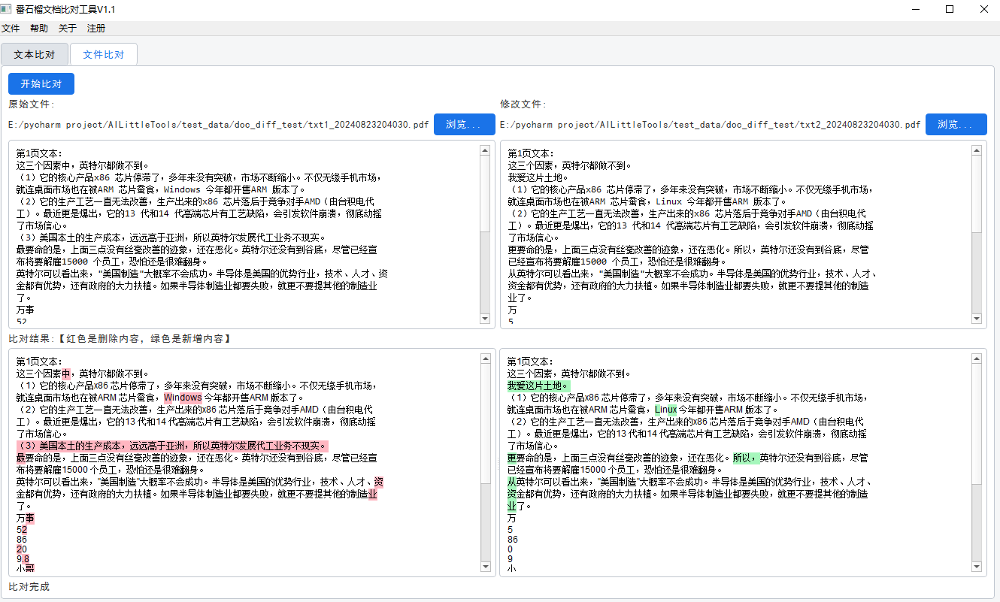
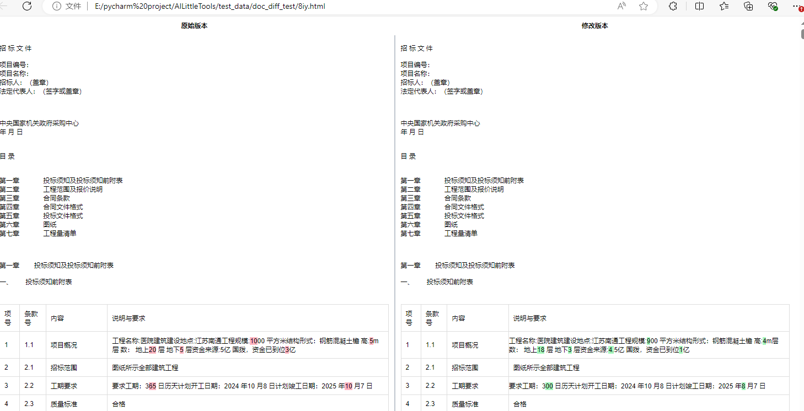
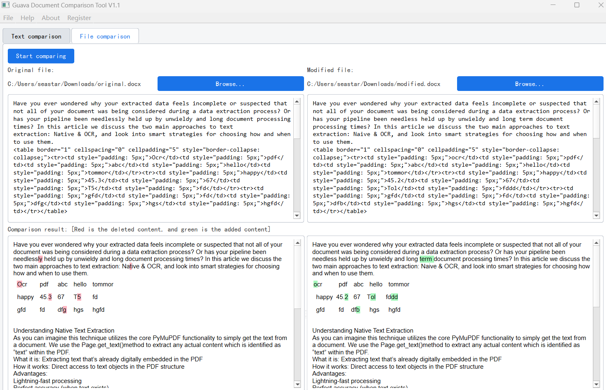
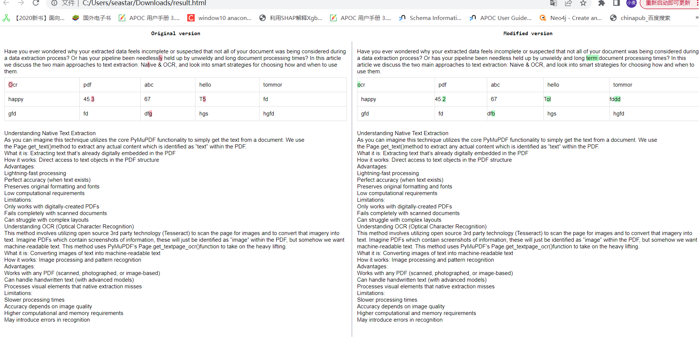

## Document Comparison Desktop Software

### Introduction

Document comparison desktop software, used for document content comparison, with the comparison results saved in html format.

Currently, the formats supported by document comparison include: 

① Text comparison 

② TXT file comparison 

③ DOCX file comparison

④ Excel file comparison 

⑤ PDF file comparison

### Case

#### chinese 

1.Software Cloud storage download:

https://pan.baidu.com/s/1Ik5HdRDjAOq2RdPNY5Gkdg         extraction code: kb2a

2.huggingface download：

https://huggingface.co/jiangnanboy/doc_diff_v1.1

#### english

1.Software Cloud storage download:

https://pan.baidu.com/s/1INx-B8we0CmTE9abGsbpQA    extraction code:: b8yz

2.huggingface download：

https://huggingface.co/jiangnanboy/doc_diff_en_v1.1

关注我，联系我微信公从号：番石榴AI
